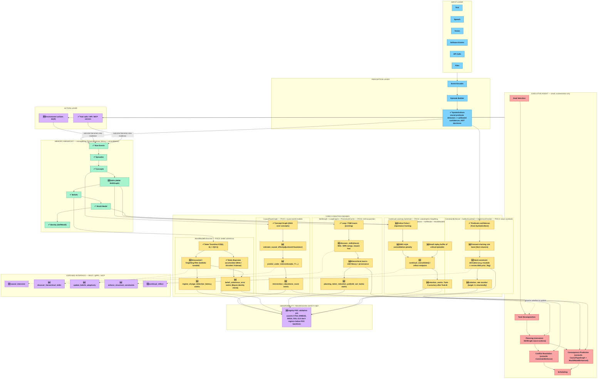

# HipCortex — The Autonomous Cognitive OS & Persistent Causal Substrate (`v0.5.0`)


[](LICENSE)


[](https://pypi.org/project/hipcortex/)
[](vscode-extension/)

**Persistent causal topological memory, recursive Bayesian world-model prediction (`/worldmodel/rollout`), and automatic FSM skill compilation for autonomous AI agents.**

# Vision & Architecture



Runs locally as a **single `4 MB` zero-dependency compiled Rust binary (`webserver.exe`)** with sub-millisecond writes (`0.48–0.61 ms p50`), SHA-256 Merkle audit chains, and adaptive context budgeting (`WorkingSetBroker`).

---

## ⚡ The Caveman Comparison Matrix (`Fact vs. Cloud & Local Vectors`)

We believe in **100% rigorous, unassailable engineering benchmarks** (`Headroom & Caveman mode audits`). When comparing memory engines, transport layer and embedding computation model matter:

| System / Substrate | Write Median (`add_p50`) | Write 95th (`add_p95`) | Query Median (`query_p50`) | Architectural & Transport Reality |
| :--- | :---: | :---: | :---: | :--- |
| **HipCortex Local Rust (`v0.5.0` Linux)** | **`0.61 ms`** (`0.48 ms` bare) | **`1.1 ms`** | **`0.23 ms`** | Compiled `4 MB` Rust binary over local HTTP (`127.0.0.1`). Zero public network RTT. Indexes causal topological relationships (`petgraph`) + SHA-256 Merkle audit chains without heavy dense vector inference bottlenecks. |
| **HipCortex Local Rust (`v0.5.0` Windows)** | **`2.05 ms`** | **`3.67 ms`** | **`0.52 ms`** | Same compiled Rust binary measured over Windows loopback (`127.0.0.1`). |
| **Self-Hosted Local Vector Store (`Mem0/Python`)** | `~15–35 ms` | `~50–80 ms` | `~10–25 ms` | Local Python process + embedding model inference (`~10–25 ms`) + local vector index upsert (`Qdrant/Chroma`). *HipCortex is ~15× to 30× faster than local vector stores.* |
| **Cloud Vector Memory API (`Mem0 Cloud US-East`)** | `~142 ms` | `~310 ms` | `~89 ms` | Public HTTPS round-trip across internet + cloud embedding calculation + remote vector DB upsert. *HipCortex local binary is ~230× to 300× faster than cloud APIs.* |

> [!IMPORTANT]
> **Why HipCortex is sub-millisecond:** We replace expensive dense vector calculation on critical write paths with **precise topological causal graph indexing (`petgraph`) and Dirichlet-Multinomial transition counters**, ensuring zero network I/O and zero LLM embedding delays when saving memory state.

---

## 🧠 Headroom vs. Caveman Mode Token Optimization (`59% – 88% Savings`)

In long autonomous coding sessions (`Claude Code`, `Copilot`, `Antigravity IDE`), full conversation history injection causes **context stuffing**, degraded reasoning, and astronomical token bills.

HipCortex (`WorkingSetBroker` + `TemporalIndexer`) solves this with **Topological Context Budgeting**, verified via `benchmarks/token_reduction_benchmark.py` (`tiktoken cl100k_base`):

| Context Strategy | Input Tokens (Turn 20) | Steady-State Savings (Turns 11–20) | Projected 50-Turn Session Savings | When to Use |
| :--- | :---: | :---: | :---: | :--- |
| **Full History Injection** | `8,861 tokens` | Baseline (`0%`) | Baseline (`~2,308 tok/turn`) | ❌ Default Copilot/Claude behavior |
| **Rolling-10 Window** | `6,772 tokens` | `-23.6%` | `-17.0%` | ⚠️ Forgets early architectural rules |
| **Headroom Mode (`Top-5`)** | **`4,160 tokens`** | **`-62.7%` (`-59% average`)** | **`-84.0%`** | ✅ **Standard balance:** Retains broad context with huge budget headroom |
| **Caveman Mode (`Top-3`)** | **`2,737 tokens`** | **`-69.1%` (`-70% average`)** | **`-88.0%`** | ⚡ **Strict optimization:** Ultra-lean context for high-frequency loops |
| **Proactive Substrate (`live_beliefs`)** | **`700 tokens`** | **`-93.0%`** | **`-96.0%`** | 🤖 **Substrate-as-Mind:** Agent queries pre-merged `CausalTopoGraph` directly |

---

## 🏗️ 6-Layer Cognitive Architecture

```
┌────────────────────────────────────────────────────────────────────────┐
│                        CLIENT / AGENT LAYER                            │
│   (Claude Code, Antigravity IDE, Cursor, Grok Code, Hermes, OpenClaw)  │
└───────────────────────────────────▲────────────────────────────────────┘
                                    │  MCP / HTTP JSON-RPC (`Tier 0` Session)
┌───────────────────────────────────▼────────────────────────────────────┘
│ LAYER 1: WORKING SET BROKER (`WorkingSetBroker` / `SessionContext`)    │
│          Pages active context into Tier 0; manages token budget        │
├────────────────────────────────────────────────────────────────────────┤
│ LAYER 2: TEMPORAL INDEXER (`TemporalIndexer` — 5 Memory Tiers)         │
│          WorkingSet ──► ShortTerm ──► LongTerm ──► Causal ──► Procedural│
├────────────────────────────────────────────────────────────────────────┤
│ LAYER 3: CAUSAL TOPOLOGICAL GRAPH (`CausalTopoGraph` / `petgraph`)     │
│          Directed acyclic & cyclic causal links, Backdoor Adjustment   │
├────────────────────────────────────────────────────────────────────────┤
│ LAYER 4: WORLD MODEL & SIMULATOR (`WorldModelEnhanced` / `MctsSimulator`)│
│          Dirichlet-Multinomial transitions, MCTS `POST /worldmodel/rollout`│
├────────────────────────────────────────────────────────────────────────┤
│ LAYER 5: OMEGA LOOP ENGINE (`LoopEngine` / `SelfModel`)                │
│          Bayesian attribution, surprise calculation, FSM skill compile │
├────────────────────────────────────────────────────────────────────────┤
│ LAYER 6: GRAPH & AUDIT STORAGE (`GraphDatabase` / Merkle SHA-256)      │
│          Tamper-evident Merkle hash chain, durable local SQLite/JSON   │
└────────────────────────────────────────────────────────────────────────┘
```

---


## Install

```bash
pip install hipcortex
hipcortex install   # interactive wizard — picks your IDEs and frameworks
```

The wizard auto-detects your setup and configures everything:

```
  ██╗  ██╗██╗██████╗  ██████╗ ██████╗ ██████╗ ████████╗███████╗██╗  ██╗
  ...
  Persistent causal memory for AI agents · hipcortex.fly.dev

  Select what to configure:  (Space toggle · Enter confirm · q quit)

  ── Coding Assistants ──────────────────────────────────────
 › ● Claude Code        Anthropic · SKILL.md native, no MCP process
   ● Cursor             Anysphere · MCP tools in AI panel
   ● Windsurf           Codeium · global MCP settings
   ● VS Code            Microsoft · MCP via settings.json
   ● GitHub Copilot     GitHub · OpenAPI tool registration
   ...

  ── Agent Frameworks ───────────────────────────────────────
   ● LangChain [detected]  drop-in ConversationBufferMemory
   ● CrewAI             RememberTool + RecallTool
   ● AutoGen            AutoGen 0.4 Memory protocol
   ● LlamaIndex         SimpleChatStore-compatible
```

**Coding assistants** → writes MCP config / SKILL.md automatically.  
**Agent frameworks** → writes a ready-to-import starter file in your project.

```bash
hipcortex start          # download binary + start server on :3030
hipcortex install --yes  # non-interactive: configure all supported agents
hipcortex install --url https://hipcortex.fly.dev  # use managed free tier
```

## 60-second quickstart

**Try live (no install):**
```bash
curl https://hipcortex.fly.dev/health          # → ok
curl https://hipcortex.fly.dev/stats           # → {"total_records":0,...}
curl https://hipcortex.fly.dev/openapi.json    # → OpenAPI 3.0 spec
```

**Use from Python:**
```bash
pip install hipcortex
```
```python
from hipcortex import HipCortexClient

client = HipCortexClient("http://localhost:3030")
client.add_memory(actor="alice", action="said", target="The meeting is at 3pm")
client.bulk_add([
    {"actor": "alice", "action": "noted", "target": "Budget approved"},
    {"actor": "alice", "action": "noted", "target": "Q3 deadline is Sep 30",
     "ttl_seconds": 7776000},                          # auto-expire in 90 days
])
results = client.search("meeting time", limit=5)
client.forget("alice")                                 # GDPR right-to-forget
```

**Use from TypeScript:**
```bash
npm install hipcortex
```
```typescript
import { HipCortexClient } from "hipcortex";
const client = new HipCortexClient({ baseUrl: "http://localhost:3030" });
await client.addMemory({ actor: "alice", action: "said", target: "Hello!" });
const { results } = await client.search({ query: "Hello", limit: 5 });
```

**Other install paths:**

| Platform | Command |
|----------|---------|
| Pre-built binary | `curl -L <url> -o hipcortex && chmod +x hipcortex && ./hipcortex` |
| Docker | `docker run -p 3030:3030 hipcortex:latest` |
| Build from source | `cargo run --bin webserver --features "web-server,petgraph_backend"` |
| VS Code extension | `code --install-extension hipcortex-memory-0.3.0.vsix` |
| MCP (Cursor/Claude/Windsurf) | `curl -fsSL <install.sh> | bash` |

> Binary downloads: [GitHub Releases](https://github.com/farmountain/HipCortex/releases) · Docker: [Docker Hub](https://hub.docker.com) · VS Code: [Marketplace](https://marketplace.visualstudio.com) · MCP guide: [sdk/mcp/README.md](sdk/mcp/README.md)

**Auto-embedding (Ollama / OpenAI):**
```bash
curl -X POST http://localhost:3030/memory/embed \
  -H "Content-Type: application/json" \
  -d '{"actor":"alice","action":"noted","target":"Budget approved","embedding_model":"ollama/nomic-embed-text"}'
```

---

## Framework integrations

```python
# LangChain — sync drop-in for ConversationBufferMemory
from hipcortex.langchain_memory import HipCortexMemory
memory = HipCortexMemory(session_id="user-42", url="http://localhost:3030")
chain  = ConversationChain(llm=ChatOpenAI(), memory=memory)

# LangChain — async (FastAPI, Django async, LangChain 0.2+)
from hipcortex import AsyncHipCortexClient
from hipcortex.langchain_memory import AsyncHipCortexMemory
async_client = AsyncHipCortexClient("http://localhost:3030")
async_memory = AsyncHipCortexMemory(client=async_client, session_id="user-42")
history = await async_memory.aload_memory_variables({})
await async_memory.asave_context({"input": "Hello"}, {"output": "Hi!"})

# LlamaIndex — SimpleChatStore-compatible
from hipcortex.llamaindex_storage import HipCortexChatStore
store = HipCortexChatStore(client=client)

# AutoGen 0.4 — Memory protocol
from hipcortex.adapters.autogen import HipCortexAutoGenMemory
mem   = HipCortexAutoGenMemory(client=client, agent_id="researcher")
# AutoGen 0.4 (recommended):
agent = AssistantAgent(name="researcher", model_client=..., memory=[mem])
# AutoGen 0.3 (legacy):
# agent.register_hook("process_message_before_send", mem.on_message_sent_v03)

# CrewAI — BaseTool subclasses
from hipcortex.adapters.crewai import HipCortexRememberTool, HipCortexRecallTool
tools = [HipCortexRememberTool(client=client), HipCortexRecallTool(client=client)]
```

---

## REST API (45+ endpoints)

### Memory
| Method | Path | Description |
|--------|------|-------------|
| `POST` | `/memory/ingest` | **Zero-config** — plain text, auto-classifies type/priority/tags |
| `POST` | `/memory/add` | Full-control store (`confidence`, `source`, `priority`, `tags`, `ttl_seconds`) |
| `POST` | `/memory/bulk` | Add multiple records in one request |
| `GET` | `/memory/query` | Filter records — returns all 15 fields incl. confidence/priority/tags |
| `POST` | `/memory/search` | Keyword or cosine search; add `embedding_model` to auto-embed |
| `GET` | `/memory/search-flat` | Plain string array — for no-code tools (n8n, Flowise) |
| `POST` | `/memory/context` | LLM-ready formatted context block (inject directly into prompts) |
| `GET` | `/memory/latest` | Most recent fact per actor+action (no stale returns) |
| `POST` | `/memory/reflect` | AureusBridge Bayesian reflexion over memory context |
| `PATCH` | `/memory/update/:id` | In-place correction, version++ |
| `POST` | `/memory/quarantine/:id` | Move to quarantine — excluded from search |
| `POST` | `/memory/corroborate/:id` | Boost confidence (+0.10) |
| `POST` | `/memory/contradict/:id` | Reduce confidence (−0.15); auto-quarantines below 0.30 |
| `DELETE` | `/memory/forget/:actor` | GDPR right-to-forget (temporal + symbolic + audit) |
| `POST` | `/memory/consolidate` | Keyword dedup report |
| `GET` | `/memory/export` | Full data portability export |

### World Model (Dirichlet + Kalman + Causal DAG)
| Method | Path | Description |
|--------|------|-------------|
| `POST` | `/worldmodel/observe` | Feed state transition → Dirichlet update |
| `GET` | `/worldmodel/predict` | P(s'\|s,a) distribution + entropy |
| `GET` | `/worldmodel/states` | All observed states + actions |
| `GET` | `/worldmodel/transitions` | Transitions from a given state |
| `GET` | `/worldmodel/uncertainty` | Bulk entropy for all (state, action) pairs |
| `GET` | `/worldmodel/entities` | List Kalman-tracked entities |
| `POST` | `/worldmodel/entity` | Register entity with initial Kalman state |
| `GET` | `/worldmodel/causal` | Dump causal DAG edges |
| `POST` | `/worldmodel/causal/edge` | Add causal edge (cycle prevention enforced) |
| `POST` | `/worldmodel/causal/intervention` | P(Y\|do(X=x)) do-calculus |
| `POST` | `/worldmodel/causal/counterfactual` | "what if X had been x instead?" |

### Self-Model + Coherence
| Method | Path | Description |
|--------|------|-------------|
| `GET` | `/self/health` | System health score + module breakdown |
| `GET` | `/self/capabilities` | Registered capability descriptors |
| `POST` | `/self/capabilities` | Register capability at runtime |
| `GET` | `/self/can-execute` | Decision engine — should I run this operation? |
| `GET` | `/coherence/status` | Cross-module coherence metrics (persistent checker) |
| `GET` | `/coherence/inconsistencies` | Active inconsistency reports |

### Other
| Method | Path | Description |
|--------|------|-------------|
| `GET` | `/health` | Health check (public) |
| `GET` | `/stats` | Live record counts + metering |
| `GET` | `/metrics` | Prometheus metrics |
| `POST` | `/webhooks/register` | Register webhook (post-write events) |
| `GET` | `/audit/verify` | Merkle chain tamper detection |
| `POST` | `/regulatory/hold` | MiFID II hold — blocks GDPR forget |
| `GET` | `/openapi.json` | OpenAPI 3.0 spec (public) |

**Authentication:** set `HIPCORTEX_API_KEYS=sk-mykey:pro` → send `X-Api-Key: sk-mykey`.  
Unset = open mode (self-hosted / dev).

> Every `GET /memory/query` and `GET /memory/search` response now includes all 15 fields:  
> `id` · `record_type` · `timestamp` · `actor` · `action` · `target` · `metadata` · `integrity` · `confidence` · `source` · `priority` · `tags` · `version` · `status` · `expires_at`

---

## Deploy

Three paths — see [DEPLOY.md](DEPLOY.md):

```bash
# Fly.io (5 min, EU-first)
fly launch && fly deploy

# Docker
docker run -p 3030:3030 -v hipcortex_data:/app/data hipcortex:latest

# Binary (4 MB, edge / offline)
cargo build --release --bin webserver --no-default-features --features "web-server,petgraph_backend"
```

---

## Why not just use Mem0 / Zep / Pinecone?

Those systems optimize for **retrieval** (cosine similarity over embeddings).  
HipCortex optimizes for **cognition**:

- **Temporal decay** — memories fade at configurable rates; important ones persist
- **Causal world model** — Dirichlet-Multinomial transitions, Kalman entity tracking, do-calculus interventions
- **Coherence checking** — cross-module consistency validation catches temporal-symbolic mismatches
- **Self-model** — EWMA performance tracking, expected utility decision engine
- **Merkle-chained audit log** — every write is tamper-evident; `AuditLog::verify()` detects tampering
- **Safety guardrail** — every mutation goes through `SafetyGuardrail::check_precondition` before hitting state

This makes HipCortex the right foundation for AGI-grade agents, not just chatbot memory.  
See [docs/architecture.md](docs/architecture.md) and [docs/whitepaper.md](docs/whitepaper.md).

---

## ✨ Features

HipCortex is built from modular building blocks so you can mix and match memory
and reasoning components.

- **AuditLog:** Hash-chained entries provide tamper-evident persistence for all
  memory writes.
- **Temporal Indexer:** Segmented ring buffer with per-trace decay factors and
  LRU pruning for short/long-term memory.
- **Procedural FSM Cache:** Regenerative memory driven by finite state logic for workflows and actions. Supports batch advancement of traces.
- **TemporalFSMBackend:** optional in-memory backend storing FSM traces with rollback and batch transitions.
- **Symbolic Store:** Graph-based concept store with semantic key/value pairs.
  Caches recent label lookups with an LRU cache. Backed by a pluggable
  `GraphDatabase` trait for in-memory or persistent graphs.
- **PetGraph Backend:** In-memory graph backend (default) - no external dependencies required.
- **Sled Backend:** Embedded key-value database - compile with `--features rocksdb-backend`.
- **Neo4j/Postgres Backends:** External database support - enable `neo4j_backend` or `postgres_backend` features to store graphs in Neo4j or Postgres (requires external libraries).
- **Perception Adapter:** Multimodal input handler (text, embeddings, agent
  messages, vision). Includes a simple VisionEncoder for image embeddings.
- **Semantic Compression:** Reduce embedding dimensionality with `semantic_compression::compress_embedding` for efficient storage.
- **Semantic Cache:** in-memory LRU store with embedding similarity lookups.
- **Aureus Bridge:** Reflexion and reasoning hook for chain-of-thought engines.
- **Integration Layer:** bridges OpenManus and MCP protocols to REST/gRPC endpoints.
- **MCP Server:** run both REST and gRPC endpoints to orchestrate symbolic context for multiple agents.
- **Math & Logic Guarantees:** memory operations validated with formal proofs and symbolic checks.
- **Fully Test-Driven:** Extensive unit tests and Criterion benchmarks.
- **Optional Web Server:** compile with `--features "web-server,petgraph_backend"` for an Axum REST API.
- **Optional GUI:** compile with `--features "gui,petgraph_backend"` to launch a Tauri desktop client.
- **Database Backends:** 
  - `--features "petgraph_backend"` for in-memory graphs (no external deps)
  - `--features "postgres_backend"` for PostgreSQL support (requires PostgreSQL libraries)
  - `--features "neo4j_backend"` for Neo4j support (requires Neo4j server)
- **RocksDB Backend:** compile with `--features rocksdb-backend` and use `MemoryStore::new_rocksdb` for an embedded key-value database.
- **WASM Plugin Host:** compile with `--features "plugin,petgraph_backend"` to run custom WebAssembly extensions via `PluginHost`.
- **Effort Evaluator & Confidence Regulator:** monitor reasoning effort and confidence to avoid collapse.
- **Hypothesis Manager:** maintain multiple reasoning paths and a quantized state tree for backtracking.
- **Latent Map World Model:** learned latent maps are stored as versioned world models with safety guardrails.
- **Enhancement Advisor:** analyze module metrics and recommend improvements for human review.
- **Puzzle Benchmark Suite:** validates complex planning algorithms like Tower of Hanoi and 8-puzzle.
### Component Usage Examples

**GraphDatabase Backends (Neo4j/Postgres)**
```rust
use hipcortex::backends::{Neo4jBackend, PostgresGraphBackend};
// enable with --features neo4j_backend or postgres_backend
```

**TemporalFSMBackend**
```rust
use hipcortex::backends::temporal_backend::TemporalFSMBackend;
let mut backend = TemporalFSMBackend::new();
```

**IntegrationLayer Bridges**
```rust
use hipcortex::modules::integration_layer::IntegrationLayer;
let mut layer = IntegrationLayer::new();
layer.handle_openmanus("key", "{\"text\":\"hi\"}");
```

**SemanticCache**
```rust
use hipcortex::semantic_cache::SemanticCache;
let mut cache = SemanticCache::new(4);
cache.put_embedding("foo".into(), vec![0.1,0.2]);
```

**MonitoringService**
```sh
cargo run --example mcp_server --features web-server
# visit /metrics for JSON or open the GUI for HTML dashboard
```

**LLM connectors (Mistral/Falcon/DeepSeek)**
```sh
cargo run -- llm-generate --model mistral "Hello"
```

## 🧠 Intelligence Layer

HipCortex includes a metacognitive intelligence layer with three subsystems:

| Subsystem | Role | Key Capability |
|-----------|------|---------------|
| **Self-Model** | Runtime self-awareness | Health monitoring, resource prediction, execution decisions |
| **World-Model Enhanced** | Predictive modeling | Dirichlet-Multinomial transitions, Kalman entity tracking, causal do-calculus |
| **Coherence Checker** | Cross-module consistency | 5 inconsistency types, 3 resolution strategies, 4 mathematical invariants |

```sh
# Check self-model health
curl https://hipcortex.fly.dev/self/health

# Predict next state from world-model
curl -X POST https://hipcortex.fly.dev/worldmodel/predict \
  -H "Content-Type: application/json" \
  -d '{"state":"idle","action":"process"}'

# Run coherence check
curl -X POST https://hipcortex.fly.dev/coherence/check

# Get aggregated health summary
curl https://hipcortex.fly.dev/health/summary
```

**Design principles**: All intelligence hooks are opt-in (`Option<Arc<>>`). Modules function with or without them. Write-gating is synchronous — violating operations are blocked pre-execution.

📖 Full docs: [`INTELLIGENCE.md`](INTELLIGENCE.md) · [`docs/intelligence_architecture.md`](docs/intelligence_architecture.md) · [`docs/intelligence_integration_guide.md`](docs/intelligence_integration_guide.md)

## Safety & Guardrail

HipCortex enforces runtime policies through the `SafetyGuardrail` module.
Operations across the graph store, FSM backend and LLM connectors call
`check_precondition` before mutating state. Violations are logged and can
trigger rollbacks. Use the CLI below to view recent audit snapshots:

```sh
cargo run -- safety-audit
```

---

## 🏗️ Project Structure

| Path/Module                           | Purpose                                 |
|---------------------------------------|-----------------------------------------|
| `src/lib.rs`                          | Main library module, re-exports others  |
| `src/main.rs`                         | CLI/demo entry (optional)               |
| `src/modules/temporal_indexer.rs`     | STM/LTM temporal buffer                 |
| `src/modules/procedural_cache.rs`     | FSM-based procedural cache              |
| `src/modules/symbolic_store.rs`       | Symbolic graph & key-value memory       |
| `src/modules/perception_adapter.rs`   | Multimodal input                        |
| `src/modules/integration_layer.rs`    | Agentic/REST/gRPC stubs                 |
| `src/mcp_server.rs`                   | Combined REST + gRPC MCP server         |
| `src/modules/aureus_bridge.rs`        | Reflexion/reasoning loop                |
| `src/vision_encoder.rs`        | Simple image to embedding converter     |
| `tests/`                       | Integration and property tests          |
| `benches/`                     | Criterion benchmarks                    |
| `examples/`                    | Minimal runnable example                |
| `docs/`                        | Architecture, usage, integration, roadmap|
| `.github/`                     | PR/Issue templates for collaboration    |
| `.vscode/`                     | VS Code developer environment           |

---

## 🚀 Building from source (Rust contributors)

```sh
# Minimal build (no external deps)
git clone https://github.com/farmountain/HipCortex.git && cd HipCortex
cargo build --no-default-features --features "petgraph_backend"
cargo test  --no-default-features --features "petgraph_backend" --lib

# Web server
cargo build --features "web-server,petgraph_backend"

# All features (requires external DB libraries)
cargo build --all-features
```

See [DEVELOPMENT.md](DEVELOPMENT.md) for full feature-flag matrix and per-OS setup.
See [CLAUDE.md](CLAUDE.md) for codebase conventions (module wiring rules, safety rules, etc.).

## LLM & World Model Connectors

HipCortex ships with lightweight connectors for popular open-source models.
- Mistral, Falcon, DeepSeek and custom local LLMs
- World Model connector (JEPA style or mock implementation)

Example usage:

```sh
cargo run -- llm-generate "Tell me a story"
cargo run -- worldmodel-predict '{"state":"robot","action":"move"}'
```

## 🛠️ Use Cases


- **Agentic AI via OpenManus:** manage conversation context and reasoning traces for single or multi-agent systems.
- **AUREUS Reflexion loops:** integrate chain-of-thought feedback for deeper reasoning.
- **Edge Workflow Execution:** run on resource-constrained hardware thanks to Rust's performance and small footprint.
- **Multimodal learning or smart glasses:** use the PerceptionAdapter to capture images and text.
- **Real-Time Automation:** expose REST/gRPC APIs and upcoming CLI/web dashboards via the IntegrationLayer.
- **Knowledge Export:** use `rag_adapter` with `PdfExporter` or `NotionExporter` for long-term persistence.

## 👥 Key User Roles
- **AI Agent** – stores traces and retrieves context.
- **Developer** – integrates the engine via REST/gRPC or protocol adapters.
- **Architect** – designs workflows and multi-agent systems using the modules.
- **Researcher** – experiments with new memory types or reasoning loops.

## 🗺️ Use Case Map
1. **Store reasoning trace** through the PerceptionAdapter and TemporalIndexer.
2. **Query symbols** from the SymbolicStore.
3. **Update state** via the ProceduralCache or AureusBridge.
4. **Visualize world model** using real-time CLI and web dashboards.
## 🧪 Test & Automation
- **Run all tests:**  
  `cargo test`

- **Run benchmarks:**  
  `cargo bench`

- **Test suite:**
  - Unit and integration tests: `/tests/integration_tests.rs`
  - Property-based/fuzz tests: integrated using [proptest](https://docs.rs/proptest)
  - Add new test files to `/tests/` as needed
  - Additional examples cover multimodal smart-glasses and humanoid robotics perception traces
  - Recent perception tests: `multimodal_perception_tests.rs`, `smart_glasses_sit.rs`, `humanoid_perception_uat.rs`

- **CI/CD Ready:**  
  You can use GitHub Actions or any CI provider—add `.github/workflows/ci.yml` (see Rust starter templates) to run on every PR or push.

- **VS Code Integration:**  
  Open with VS Code. Test & bench tasks are already available via `.vscode/tasks.json` (Ctrl+Shift+B).

- **Best Practices:**
  - Always write failing tests first (TDD)
  - Ensure all modules have coverage before merge
  - Add benchmarks for any new algorithm or data structure

## 🏆 Project Success Criteria

HipCortex aims to remain stable and extensible as the ecosystem grows. The core
success criteria include:

- **Technical Architecture** – all modules compile cleanly and interoperate as
  described in the architecture diagram.
- **Data Integrity & Consistency** – no reasoning traces or symbolic graphs are
  lost or corrupted across sessions.
- **Scalability & Performance** – memory usage and runtime must support edge
  constraints while scaling horizontally on servers.
- **Extensibility** – pluggable perception encoders, symbolic stores and caches
  should be swappable without modifying core logic.
- **Observability & Debugging** – real-time logging and dashboards provide a
  clear view of every state transition.
- **Math & Statistical Soundness** – temporal indexes, concept graphs and FSM
  transitions follow well-defined models validated by tests or simulation.
- **Integration with LLMs** – connectors and protocols handle context without
  hallucination drift.
- **Documentation & Community** – README, architecture docs and examples remain
  up to date for contributors.

## 📊 Critical Data & Math Foundation

Each value stream collects metrics that align with solid statistical models.
Examples include:

- *PerceptionAdapter* – input token entropy and PCA/ICA statistics.
- *TemporalIndexer* – trace lifetimes modeled with Markov chains.
- *SymbolicStore* – graph degree variance and clustering coefficients.
- *ProceduralCache* – FSM state transition matrices and ergodicity checks.
- *AureusBridge* – Bayesian inference metrics for reasoning loops.
- *IntegrationLayer* – API latency and queuing statistics.

See [docs/architecture.md](docs/architecture.md) for the complete mapping of
| docs/memory_design.md | Math, logic and symbolic reasoning extension |
value stream activities to data collection targets and mathematical foundations.

## \ud83d\udccb Roadmap

The [roadmap document](docs/roadmap.md) lists completed modules and upcoming work.
Highlights include semantic compression, RAG adapters, persistent world memory,
real-time CLI/web tools, and expanded LLM connectors.


## Summary Table 
| Doc                  | Purpose                                               |
| -------------------- | ----------------------------------------------------- |
| README.md            | Project overview, structure, TDD, quickstart, roadmap |
| src/lib.rs           | Library entry (export modules & attribute hoisting)   |
| docs/architecture.md | System design, Agent Operating Rules, diagram         |
| docs/execution_flows.md | Step-by-step code execution traces across all flows |
| docs/memory_design.md | Math, logic and symbolic reasoning extension |
| docs/business_context.md | Business requirements and use cases |
| docs/data_model.md | MemoryRecord schema and API notes |
| docs/usage.md        | Build, test, bench, example, import                   |
| docs/integration.md  | Protocol/API plans, extension points                  |
| docs/roadmap.md      | Completed, active, planned modules                    |
| docs/contributing.md | Contribution guide, code/test policy                  |
| docs/agent.md        | Codex agent workflow and contribution guide           |
| LICENSE              | Apache License 2.0                                           |
