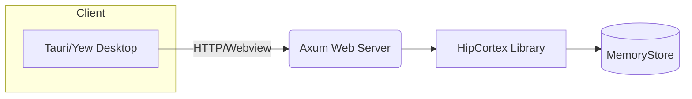

# HipCortex Architecture

HipCortex is a modular AI memory engine with these key principles:

- **Temporal Memory:** Short-term and long-term memory, managed with decay and LRU.
- **Procedural Memory:** FSM-driven, agentic "reasoning/action" traces, for procedural or regenerative workflows.
- **Symbolic Memory:** Graph-based, human-interpretable key-value and concept memory.
- **Perception Adapter:** Handles multimodal input (text, embeddings, agent messages, vision via `VisionEncoder`).
- **Aureus Bridge:** Reflexion and reasoning integration (for AUREUS, chain-of-thought, and agent feedback).
- **Integration Layer:** Ready for REST/gRPC/agent protocols (OpenManus, MCP, etc).

## Module Interaction Diagram

```mermaid
flowchart TD
    Percept[PerceptionAdapter] --> Trace[Memory Trace/Concept]
    Trace --> STM[TemporalIndexer]
    Trace --> Symb[SymbolicStore]
    STM & Symb --> FSM[ProceduralCache (FSM)]
    FSM --> Reason[AureusBridge]
    Reason --> API[IntegrationLayer]
```

## Solution Overview

Each component focuses on a single responsibility and can be replaced or
extended as your use case grows.

1. **Perception Adapter** – normalizes text, embeddings and vision input using `VisionEncoder` into memory traces.
2. **Temporal Indexer** – stores recent traces with decay logic for short or
   long‑term retention.
3. **Symbolic Store** – maintains a graph of concepts and relationships.
4. **Procedural Cache** – drives FSM-based workflows and regenerative actions.
5. **Aureus Bridge** – plugs in reflexion or chain‑of‑thought reasoning loops.
6. **Integration Layer** – exposes REST/gRPC endpoints and protocol adapters.

This layered approach allows efficient reasoning on edge devices while remaining
extensible for server deployments.

## Use Case Scenarios

- **Agent Memory Engine:** capture conversations and state transitions for AI or
  human agents.
- **Retrieval Pipelines:** power RAG or search features through the Symbolic
  Store and Temporal Indexer.
- **Edge Automation:** embed the engine on resource‑constrained hardware to
  manage workflows locally.
- **Real‑Time Interfaces:** build dashboards or CLI tools using the Integration
  Layer.

See the [README](../README.md) and [Roadmap](./roadmap.md) for planned modules
like vision encoding, semantic compression, and persistent world memory.

---

## Extended Solution Architecture

When compiled with the optional `web-server` feature, HipCortex exposes a minimal REST API using Axum. A Tauri-based GUI can also be enabled via the `gui` feature. The high level flow is shown below:



These components remain optional and are disabled by default to keep the core lightweight.
