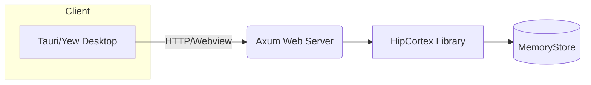

# HipCortex Architecture

HipCortex is a modular AI memory engine with these key principles:

- **Temporal Memory:** Short-term and long-term memory, managed with decay and LRU.
- **Procedural Memory:** FSM-driven, agentic "reasoning/action" traces, for procedural or regenerative workflows.
- **Symbolic Memory:** Graph-based, human-interpretable key-value and concept memory.
- **Perception Adapter:** Handles multimodal input (text, embeddings, agent messages, vision via `VisionEncoder`).
- **Aureus Bridge:** Reflexion and reasoning integration (for AUREUS, chain-of-thought, and agent feedback).
- **Integration Layer:** Ready for REST/gRPC/agent protocols (OpenManus, MCP, etc).

## Module Interaction Diagram

```mermaid
flowchart TD
    Percept[PerceptionAdapter] --> Trace[Memory Trace/Concept]
    Trace --> STM[TemporalIndexer]
    Trace --> Symb[SymbolicStore]
    STM & Symb --> FSM[ProceduralCache (FSM)]
    FSM --> Reason[AureusBridge]
    Reason --> API[IntegrationLayer]
```

## Solution Overview

Each component focuses on a single responsibility and can be replaced or
extended as your use case grows.

1. **Perception Adapter** – normalizes text, embeddings and vision input using `VisionEncoder` into memory traces.
2. **Temporal Indexer** – stores recent traces with decay logic for short or
   long‑term retention.
3. **Symbolic Store** – maintains a graph of concepts and relationships via a
   pluggable `GraphDatabase` backend. Supports both in-memory graphs and the
   persistent `SledGraph` implementation for durability.
4. **Procedural Cache** – drives FSM-based workflows and regenerative actions.
5. **Aureus Bridge** – plugs in reflexion or chain‑of‑thought reasoning loops.
6. **Integration Layer** – exposes REST/gRPC endpoints and protocol adapters.
7. **LLM Connectors** – clients for OpenAI, Claude, Ollama and other open-source models.

This layered approach allows efficient reasoning on edge devices while remaining
extensible for server deployments.

## Use Case Scenarios

- **Agent Memory Engine:** capture conversations and state transitions for AI or
  human agents.
- **Retrieval Pipelines:** power RAG or search features through the Symbolic
  Store and Temporal Indexer.
- **Edge Automation:** embed the engine on resource‑constrained hardware to
  manage workflows locally.
- **Real‑Time Interfaces:** build dashboards or CLI tools using the Integration Layer.
- **Prompt-based Reflexion:** call LLM connectors (OpenAI, Claude, Ollama) for reasoning loops.

## Key User Roles
- **AI Agent** – interacts with the memory engine.
- **Developer** – integrates modules and APIs.
- **Architect** – designs workflows and world models.
- **Researcher** – experiments with memory and reasoning techniques.

## High-Level Use Case Map
1. **Store reasoning trace** with PerceptionAdapter and TemporalIndexer.
2. **Query symbols** from the SymbolicStore.
3. **Update state** through ProceduralCache or AureusBridge.
4. **Visualize world model** via real-time CLI or web interfaces.

See the [README](../README.md) and [Roadmap](./roadmap.md) for additional modules
like vision encoding and semantic compression.

---

## Extended Solution Architecture

When compiled with the optional `web-server` feature, HipCortex exposes a minimal REST API using Axum. A Tauri-based GUI can also be enabled via the `gui` feature. The high level flow is shown below:



These components remain optional and are disabled by default to keep the core lightweight.

## Security and Integrity

HipCortex now includes optional AES-GCM encryption for memory files. `MemoryStore::new_encrypted` loads and writes encrypted JSONL where each record is protected with a per-entry nonce. `new_encrypted_envelope` adds envelope encryption by storing a per-file session key sealed with a master key. Each `MemoryRecord` carries a SHA-256 integrity hash which is verified when loading from disk.
An append-only `audit.log` is written next to the memory file. Each entry is chained with a Merkle-style hash so tampering is detectable. `MemoryStore` also maintains a small write-ahead log for crash recovery, supports snapshot rollback with integrity checks, and batches writes for performance.
`MemoryStore` can operate with asynchronous buffered writes when compiled with the `async-store` feature for high-throughput ingestion. The async variant mirrors the synchronous file backend with AES-GCM encryption, envelope keys, compression and crash-recovery WAL so large event streams can be ingested without blocking.

IndexMap based lookup tables accelerate queries by actor, action and target.
`VisionEncoder` supports parallel batch encoding via Rayon and an optional GPU path built on `wgpu`. When no compatible device is detected, the GPU encoder gracefully falls back to the CPU implementation so tests and headless deployments still succeed.

`ProceduralCache` provides `advance_batch` to step multiple FSM traces at once, and the CLI offers paginated queries.

`PerceptionAdapter` now enforces a simple rate limiter to avoid abuse, while `IntegrationLayer` checks API keys before forwarding messages or invoking LLMs.
`IntegrationLayer` can also register OAuth2 bearer tokens. Incoming JSON payloads are validated with Serde custom validators to reject malformed input.
`AuditLog::verify` can be used to confirm the Merkle chain has not been tampered with.

The new `MemoryBackend` trait enables pluggable persistence layers. A RocksDB-backed implementation is provided in addition to the default file backend so deployments can use an embedded key-value store without code changes. `TemporalIndexer` now uses a segmented ring buffer for better scalability. `SymbolicStore` caches recent label lookups with an LRU cache to speed up graph queries. `ProceduralCache` can save and load checkpoints for resilience. Optional WASM plugins run through a `PluginHost` when compiled with the `plugin` feature. Build with `--features plugin` to enable this runtime extension capability.

Additional modules extend HipCortex further:

- **Semantic Compression**: `semantic_compression::compress_embedding` reduces embedding dimensionality for cost efficiency and is used by `PerceptionAdapter` when handling embeddings.
- **Memory Diff**: `memory_diff::diff_snapshots` compares snapshot files to visualize evolution over time.
- **A2A Protocol**: simple peer clients implement `A2AClient` to exchange procedural traces.
- **Secure LLM Sandbox**: `sandbox::SecureLLMSandbox` renders templates with whitelisted variables before sending to LLMs.
- **World Model Dashboard**: when the `web-server` feature is enabled, `dashboard::routes` exposes memory data for a lightweight web UI.
- **gRPC Server**: enabling the `grpc-server` feature spins up a Tonic-based service for adding and listing memory records.
 - **Effort Evaluator & Confidence Regulator**: measure reasoning effort and confidence decay to avoid collapse.
 - **Hypothesis Manager**: maintain multiple reasoning branches and a quantized state tree for backtracking.
- **Enhancement Advisor**: evaluate module metrics and suggest improvements for human operators.
- **Puzzle Benchmark Suite**: verifies complex planning algorithms to gauge collapse resilience.

## Value Stream Data Collection

Each module gathers metrics to validate behavior and ensure consistency:

| Component | Critical Data | Mathematical Foundation |
|-----------|---------------|-------------------------|
| PerceptionAdapter | Input embeddings, vision outputs | Signal processing, PCA/ICA |
| TemporalIndexer | Timestamps, actor/action tuples | Markov chains |
| SymbolicStore | Graph nodes and edge counts | Graph theory, centrality |
| ProceduralCache | FSM transitions, execution counts | Automata theory |
| AureusBridge | Reasoning steps and convergence stats | Bayesian inference |
| IntegrationLayer | API latency, error rates | Queuing theory |
| AuditLog | Event logs and anomaly flags | Log likelihood estimation |
| HypothesisManager | Hypothesis counts and scores | Hypothesis testing |
| Dashboard/GUI | Real-time graphs | Visualization algorithms |
| SemanticCompression | Compression ratio | Information theory |
| MemoryDiff | Snapshot differences | Diff algorithms |
| EnhancementAdvisor | Optimization hints | Heuristic analysis |

## Mathematical Foundations

HipCortex relies on well-defined models. Temporal buffers use sequence modeling,
symbolic graphs apply clustering coefficients, and FSM caches compute transition
matrices. Stats collectors calculate moving averages and standard deviation for
each module so anomalies can be detected early.

## Memory Design Guarantees

HipCortex now exposes a unified memory model backed by mathematics, logic and symbolic reasoning.
Each component records a verifiable chain of thought:

- **PerceptionAdapter** decorrelates inputs with PCA and verifies schema rules.
- **TemporalIndexer** uses Markov assumptions to maintain causal order.
- **SymbolicStore** stores typed predicates in a connected graph.
- **ProceduralCache** executes FSM transitions validated against rewrite rules.
- **AureusBridge** prunes inconsistent hypotheses via Bayesian updates.
- **AuditLog** hashes every action for tamper evidence.

These guarantees are described in [docs/memory_design.md](memory_design.md).
