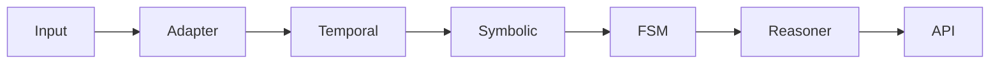

# HipCortex Memory Design

HipCortex extends classic memory engines with mathematically verified and
logically consistent symbolic reasoning. This document consolidates the core
principles, proofs and component level flow so developers can reason about the
engine at every step.

## Core Philosophy

HipCortex Memory is more than a storage layer — it is a logically verifiable,
symbolic-context memory enabling traceability, explainability and provable
correctness. Each operation is grounded in formal mathematics and checked with
logic rules so knowledge remains consistent.

## Universal Cognitive Layer Principles
- Local, private, encrypted memory for every device
- Contextual, multimodal, explainable memory and reasoning
- Universal API, plugin SDK, device/OS integration
- Edge AI, federated learning, adaptive inference
- Resilience, performance, fault tolerance, offline-first
- Developer ecosystem, interoperability, open standards

## Strategic Gaps
- Federated learning/adaptive edge AI
- Mobile/AR/automotive SDKs
- Visual explainability for users
- Plugin marketplace/ecosystem
- Open schema/standards for context/memory
- Unified privacy/user control dashboard



## Unified Design Principles

| Principle | How it is Applied |
|-----------|------------------|
| **Mathematical Validity** | Modules rely on PCA, Markov chains, graph theory, automata and Bayesian inference |
| **Logical Consistency** | Memory writes and transitions are guarded by propositional and predicate logic checks |
| **Symbolic Reasoning** | Data is parsed and stored as symbols (graphs, FSM states, logical predicates) |
| **Chain-of-Thought Verifiability** | Each reasoning step can be inspected as a series of logic rules and symbolic transforms |
| **Self-Correcting** | Contradictions are detected and resolved at runtime |
| **Compression with Fidelity** | Embeddings and graph deltas obey entropy bounds |

## Component Design

### PerceptionAdapter + Session
*Normalises raw input into symbols and decorrelated features.*
- **Math**: PCA / ICA decorrelate embeddings.
- **Logic**: Output symbols follow a schema.
- **Symbolic**: `"Paris" -> Symbol(Place, Paris)` then embedded.
- **CoT Flow**: Input -> Symbol Parse -> PCA -> Output vector.

When the input is an `AgentMessage` (common in the proactive harness), the `PerceptionSession` wrapper automatically:
- Applies self-model health/rate gating before expensive work.
- Updates the world model with entity observations (embedding as measured properties) via `WorldModelEnhanced::update_entity`.
- Runs coherence validation.
- From the `IntegrationLayer` auto path: additionally calls `record_perceived_action(text)` so the agent's message text is recorded as a state transition in the Dirichlet-Multinomial model.

This gives automatic "latest state / world model" upkeep from the agent stream with no explicit user or LLM trigger required for routine cases (high-value symbolic, hypotheses, or specific decision modeling still use explicit `ingest`/`reflect`).

### TemporalIndexer
*Buffers perception traces ordered by time.*
- **Math**: Markov chain predicts next state; Poisson models bursty input.
- **Logic**: Ordering preserves cause/effect relations.
- **Symbolic**: Trace stored as `(Actor, Action, Context, Time)`.
- **CoT Flow**: Append trace -> Update state -> Predict next trace.

### SymbolicStore
*Memory graph for semantic context.*
- **Math**: Graph connectivity, centrality, clustering.
- **Logic**: Typed predicates such as `LocatedIn(A,B)`.
- **Symbolic**: Nodes are symbols, edges are logical relations.
- **CoT Flow**: Insert node -> Connect edges -> Validate graph.

### ProceduralCache
*Finite state workflow planning.*
- **Math**: Automata theory and state transition matrices.
- **Logic**: Transitions follow predefined rules.
- **Symbolic**: States and transitions are rewrite rules.
- **CoT Flow**: Observe event -> Match rule -> Apply transition.

### AureusBridge
*Reasoning loop orchestrator.*
- **Math**: Bayesian inference with Monte Carlo sampling.
- **Logic**: Conflicting hypotheses are pruned.
- **Symbolic**: Hypotheses stored as formulas.
- **CoT Flow**: Check belief -> Gather evidence -> Update belief.

### HypothesisManager
*Maintains multiple competing hypotheses.*
- **Math**: Statistical testing with probability bounds.
- **Logic**: Hypotheses may be exclusive or complementary.
- **Symbolic**: Tree of hypotheses.
- **CoT Flow**: Rank hypotheses -> Drop weak ones.

### SemanticCompression
*Stores minimal data while preserving meaning.*
- **Math**: Entropy bounds and source coding theorem.
- **Logic**: Removes only logically redundant symbols.
- **Symbolic**: Graph delta encoding.
- **CoT Flow**: Compute entropy -> Compress -> Validate lossless.

### AuditLog
*Verifiable trace of all events.*
- **Math**: Log likelihood estimation detects anomalies.
- **Logic**: Contradictory actions are flagged.
- **Symbolic**: Log entries are assertions.
- **CoT Flow**: Log event -> Check consistency -> Flag anomaly.

### IntegrationLayer
*Exposes memory via API.*
- **Math**: Queuing theory controls load.
- **Logic**: Inputs validated as logical schemas.
- **Symbolic**: Requests and results are symbolic tuples.
- **CoT Flow**: Receive request -> Validate -> Respond.

## Chain-of-Thought Usability Flow

| Step | Logic | Symbolic | Math |
|------|-------|----------|------|
| User input | Parsed into valid predicates | Symbols generated | PCA decorrelation |
| Memory trace | Ordered and contradiction free | Timestamped tuples | Markov chain order |
| Graph context | Verified connectivity | Predicate edges | Centrality metrics |
| Action FSM | Valid transitions | Rewrite rules | Transition matrix |
| Reasoning | Consistent belief updates | Hypothesis tree | Bayesian update |
| Compression | Only logical base kept | Graph deltas | Entropy bound |
| Logs | Truth-preserving assertions | Symbolic logs | Log likelihood |
| APIs | Schema-checked input/output | Symbolic messages | Queue throughput |

## Usability and Enhancement

**User Benefits**
- Logical answers with explainable chains of reasoning.
- Memory consistency across sessions.
- Optional dashboard for live inspection.
- Compression keeps storage lean.

**Developer Benefits**
- Modular perception or reasoning can be swapped easily.
- Symbolic constraints catch bugs.
- Logic guards prevent invalid memory states.
- Memory footprint remains minimal and consistent.

### Property Test Example

```rust
proptest! {
    #[test]
    fn graph_has_path(count in 2usize..6) {
        let mut store = SymbolicStore::new();
        // build chain n0 -> n1 -> ... -> n{count} and verify a path exists
    }
}
```

Property tests like the one above ensure graph connectivity and FSM reachability.

## Next Actions
- Expand README and architecture docs with these guarantees.
- Property tests already cover graph connectivity and FSM reachability (see `tests/property`).
- Inline comments show chain-of-thought steps within modules.

